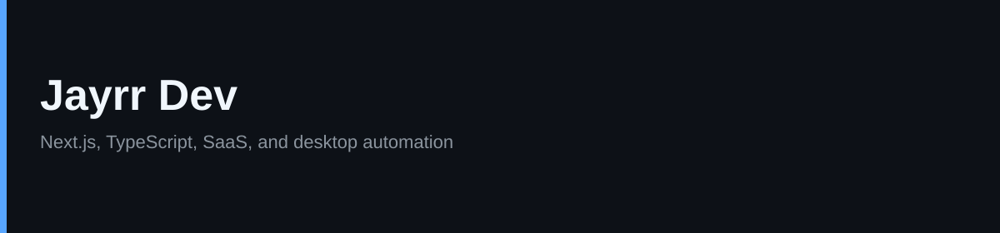

  

  <a href="https://jayrr.dev">jayrr.dev</a>
  ·
  <a href="https://github.com/Jayrr-Dev">GitHub</a>

  

I build SaaS products and small tools that take repetitive work off someone's plate. Most of that is Next.js, React, and TypeScript. When the browser is the wrong place for the job, I ship a desktop app instead.

Six years of full-stack work.

## Featured work

**[Data Entry Autonoma](https://github.com/Jayrr-Dev/DataEntryAutonoma)**  
Windows app that records a data-entry sequence once, then replays it with presets and CSV batches. AutoHotkey under the hood, ships as a standalone exe.

**[AgenitiX](https://github.com/Jayrr-Dev/AgenitiX)**  
Visual workflow builder with AI nodes, Gmail, and Sheets. Next.js, Convex, TypeScript. Live at [agenitix.vercel.app](https://agenitix.vercel.app).

**[Dyslexia TTS](https://github.com/Jayrr-Dev/dyslexia-tts-cursor-extension)**  
Cursor and VS Code extension. Reads selected code or chat aloud with Windows voices (`Alt+X`). No API key.

**[AI Fluently](https://github.com/Jayrr-Dev/aifluently.com)**  
Site for learning how to use and build AI tools. [aifluently-com.vercel.app](https://aifluently-com.vercel.app)

## Stats

  
  

