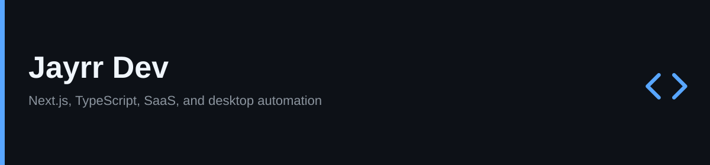

<!--
  Profile README. Layout from https://readmedesign.com/blog/github-markdown-tips-tricks
  Icons from Iconify: Lucide (ISC) and Skill Icons (MIT) https://icon-sets.iconify.design/
-->

  <picture>
    <source media="(prefers-color-scheme: dark)" srcset="assets/banner-dark.svg">
    <source media="(prefers-color-scheme: light)" srcset="assets/banner-light.svg">
    
  </picture>

  

    <a href="https://jayrr.dev">
      <picture>
        <source media="(prefers-color-scheme: dark)" srcset="assets/icons/lucide-globe-dark.svg">
        <source media="(prefers-color-scheme: light)" srcset="assets/icons/lucide-globe-light.svg">
        
      </picture>
      jayrr.dev
    </a>
    &nbsp;·&nbsp;
    <a href="https://github.com/Jayrr-Dev">
      <picture>
        <source media="(prefers-color-scheme: dark)" srcset="assets/icons/lucide-github-dark.svg">
        <source media="(prefers-color-scheme: light)" srcset="assets/icons/lucide-github-light.svg">
        
      </picture>
      GitHub
    </a>
  

  

    <picture>
      <source media="(prefers-color-scheme: light)" srcset="assets/icons/skill-typescript.svg">
      
    </picture>
    <picture>
      <source media="(prefers-color-scheme: dark)" srcset="assets/icons/skill-react-dark.svg">
      <source media="(prefers-color-scheme: light)" srcset="assets/icons/skill-react-light.svg">
      
    </picture>
    <picture>
      <source media="(prefers-color-scheme: dark)" srcset="assets/icons/skill-nextjs-dark.svg">
      <source media="(prefers-color-scheme: light)" srcset="assets/icons/skill-nextjs-light.svg">
      
    </picture>
    <picture>
      <source media="(prefers-color-scheme: dark)" srcset="assets/icons/skill-nodejs-dark.svg">
      <source media="(prefers-color-scheme: light)" srcset="assets/icons/skill-nodejs-light.svg">
      
    </picture>
    <picture>
      <source media="(prefers-color-scheme: dark)" srcset="assets/icons/skill-supabase-dark.svg">
      <source media="(prefers-color-scheme: light)" srcset="assets/icons/skill-supabase-light.svg">
      
    </picture>
    <picture>
      <source media="(prefers-color-scheme: dark)" srcset="assets/icons/skill-tailwind-dark.svg">
      <source media="(prefers-color-scheme: light)" srcset="assets/icons/skill-tailwind-light.svg">
      
    </picture>
    <picture>
      <source media="(prefers-color-scheme: dark)" srcset="assets/icons/skill-vercel-dark.svg">
      <source media="(prefers-color-scheme: light)" srcset="assets/icons/skill-vercel-light.svg">
      
    </picture>
    <picture>
      <source media="(prefers-color-scheme: dark)" srcset="assets/icons/skill-github-dark.svg">
      <source media="(prefers-color-scheme: light)" srcset="assets/icons/skill-github-light.svg">
      
    </picture>
  

I build SaaS products and small tools that take repetitive work off someone's plate. Most of that is Next.js, React, and TypeScript. When the browser is the wrong place for the job, I ship a desktop app instead.

Six years of full-stack work.

<table>
  <tr>
    <td valign="top" width="50%">
      <h3>Featured work</h3>
      <ul>
        <li>
          <a href="https://github.com/Jayrr-Dev/DataEntryAutonoma">Data Entry Autonoma</a> 
          Record a data-entry sequence once, then replay it with presets and CSV batches. Standalone Windows exe.
        </li>
        <li>
          <a href="https://github.com/Jayrr-Dev/AgenitiX">AgenitiX</a> 
          Visual AI workflow builder. Next.js, Convex, TypeScript. <a href="https://agenitix.vercel.app">agenitix.vercel.app</a>
        </li>
        <li>
          <a href="https://github.com/Jayrr-Dev/dyslexia-tts-cursor-extension">Dyslexia TTS</a> 
          Reads selected code or chat aloud in Cursor and VS Code. Press <kbd>Alt</kbd> + <kbd>X</kbd>. No API key.
        </li>
        <li>
          <a href="https://github.com/Jayrr-Dev/aifluently.com">AI Fluently</a> 
          Site for learning how to use and build AI tools. <a href="https://aifluently-com.vercel.app">aifluently-com.vercel.app</a>
        </li>
      </ul>
    </td>
    <td valign="top" width="50%">
      <h3>Stack</h3>
      <ul>
        <li>TypeScript, React, Next.js</li>
        <li>Node, Convex, Supabase</li>
        <li>Tailwind, Vercel</li>
        <li>AutoHotkey when it has to run on the desktop</li>
      </ul>
    </td>
  </tr>
</table>

Other public work

- [keyviz-custom](https://github.com/Jayrr-Dev/keyviz-custom): Keyviz fork with hotkey labels, draw mode, and a multi-monitor overlay
- [Taroter-paddle](https://github.com/Jayrr-Dev/Taroter-paddle): Next.js + Supabase billing starter
- [learn-visually](https://github.com/Jayrr-Dev/learn-visually): [learn-visually.vercel.app](https://learn-visually.vercel.app)

  <picture>
    <source media="(prefers-color-scheme: dark)" srcset="https://github-readme-stats.vercel.app/api?username=Jayrr-Dev&amp;show_icons=true&amp;theme=github_dark&amp;hide_border=true&amp;bg_color=0D1117&amp;title_color=58A6FF&amp;icon_color=58A6FF&amp;text_color=C9D1D9">
    <source media="(prefers-color-scheme: light)" srcset="https://github-readme-stats.vercel.app/api?username=Jayrr-Dev&amp;show_icons=true&amp;theme=default&amp;hide_border=true">
    
  </picture>
  <picture>
    <source media="(prefers-color-scheme: dark)" srcset="https://github-readme-stats.vercel.app/api/top-langs/?username=Jayrr-Dev&amp;layout=compact&amp;theme=github_dark&amp;hide_border=true&amp;bg_color=0D1117&amp;title_color=58A6FF&amp;text_color=C9D1D9">
    <source media="(prefers-color-scheme: light)" srcset="https://github-readme-stats.vercel.app/api/top-langs/?username=Jayrr-Dev&amp;layout=compact&amp;theme=default&amp;hide_border=true">
    
  </picture>

<a href="#top">Back to top</a>

