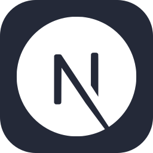

  
  <h1>Jayrr Dev</h1>
  
Building with AI made simple

  

    <a href="https://jayrr.dev">
      
      jayrr.dev
    </a>
    ·
    <a href="https://www.youtube.com/@jayrrdev">
      
      YouTube
    </a>
    ·
    <a href="https://github.com/Jayrr-Dev">
      
      GitHub
    </a>
  

  

    
    
    
    
    
    
    
    
  

I will teach you how to build with AI for your business. I share the secrets I have learned from building products with AI over the past 7 years.

Most of that work is private. SaaS products, internal tools, and client apps. GitHub only shows the small public slice.

<table>
  <tr>
    <td valign="top" width="50%">
      <h3>What I build</h3>
      <ul>
        <li>Private SaaS: billing, auth, dashboards, the unglamorous product work</li>
        <li>Internal ops tools for real companies (hours, payroll-adjacent workflows, the stuff staff use every day)</li>
        <li>AI product features: agents, workflows, ranking, visual teaching tools</li>
        <li>Next.js and TypeScript end to end, including the desktop utilities when a browser is the wrong place</li>
      </ul>
    </td>
    <td valign="top" width="50%">
      <h3>Stack</h3>
      <ul>
        <li>TypeScript, React, Next.js</li>
        <li>Node, Convex, Supabase</li>
        <li>Tailwind, Vercel</li>
        <li>AutoHotkey when it has to run on the desktop</li>
      </ul>
    </td>
  </tr>
</table>

Public side projects

These are the repos I can link. They are not the main body of work.

- [Data Entry Autonoma](https://github.com/Jayrr-Dev/DataEntryAutonoma): record a data-entry sequence and replay it, including CSV batches
- [AgenitiX](https://github.com/Jayrr-Dev/AgenitiX): visual AI workflow builder ([agenitix.vercel.app](https://agenitix.vercel.app))
- [Dyslexia TTS](https://github.com/Jayrr-Dev/dyslexia-tts-cursor-extension): read code or chat aloud in Cursor and VS Code. Press <kbd>Alt</kbd> + <kbd>X</kbd>
- [AI Fluently](https://github.com/Jayrr-Dev/aifluently.com): learning site for using and building AI tools
- [keyviz-custom](https://github.com/Jayrr-Dev/keyviz-custom): Keyviz fork with hotkey labels and a multi-monitor overlay
- [learn-visually](https://github.com/Jayrr-Dev/learn-visually): [learn-visually.vercel.app](https://learn-visually.vercel.app)

  
  
   
  

<a href="#top">Back to top</a>

